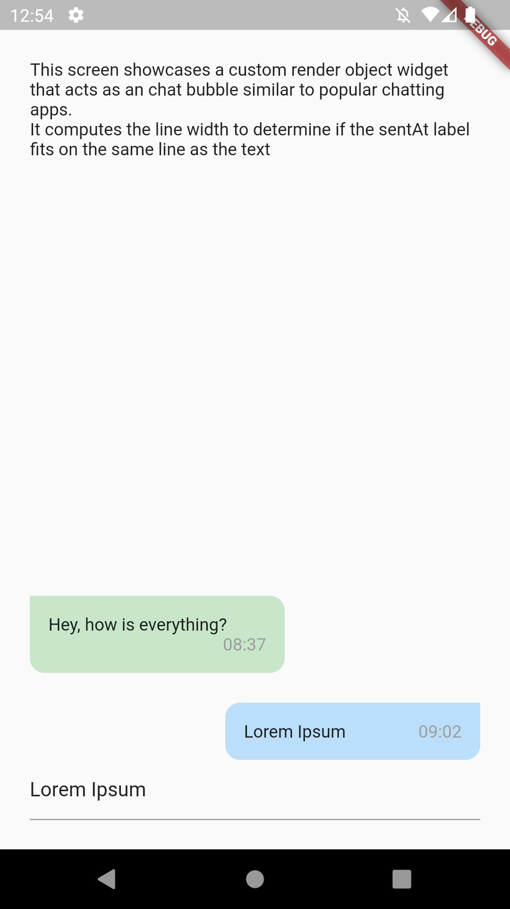
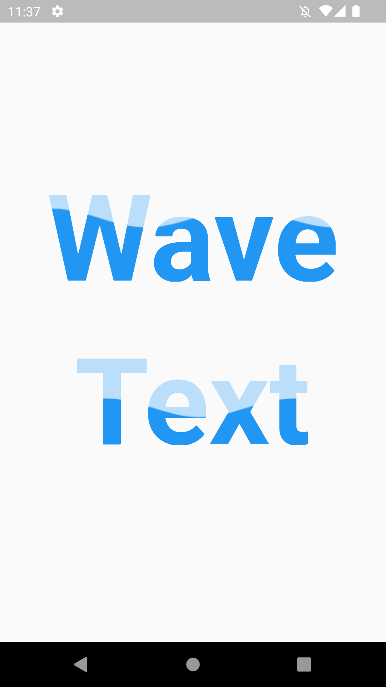

# Flutter Custom Render Objects

A flutter app that showcases some custom render object widgets.

These widgets are implemented by scratch for learning purposes.

## Chat Bubble widget

Showcases a custom render object widget that acts as an chat bubble similar to popular chatting apps.

It computes the line width to determine if the sentAt label fits on the same line as the text.

## Wave text widget

Showcases a custom render object widget that applies a wave shader into its child.

